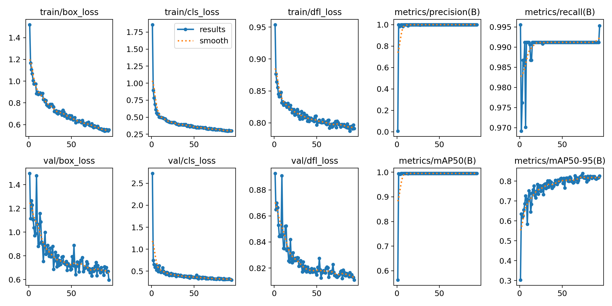

# 🏎️ JetBot Autonomous Driving Object Detection Project

> **YOLOv8 기반의 탑다운 뷰 트랙 환경 젯봇(JetBot) 실시간 객체 인식 및 임베디드 최적화 프로젝트**

본 프로젝트는 고정된 시점(Top-down)의 트랙 환경에서 젯봇을 정밀하게 탐지하고 실시간 자율주행 알고리즘의 기반을 다지기 위한 딥러닝 프로젝트입니다. 소형 임베디드 장비인 **Jetson Nano**에서의 실시간 추론(FPS) 성능을 극대화하기 위해 모델 경량화 및 ONNX 포맷 변환을 적용했습니다.

---

## 📌 Key Features (주요 특징)
- **YOLOv8 Nano 모델 활용**: 젯슨 나노 환경을 고려하여 73레이어 수준의 가벼운 `yolov8n` 아키텍처 채택
- **맞춤형 데이터 증강 기법**: 탑다운 고정 뷰의 도메인 특성을 반영한 왜곡 없는 데이터 Augmentation 적용
- **엣지 디바이스 최적화**: `320x320` 정적 입력 크기 지정 및 ONNX 포맷 변환을 통한 TensorRT 가속 준비

---

## 📊 Dataset & Data Augmentation (데이터셋 및 데이터 증강)
- **데이터 규모**: 직접 수집 및 라벨링한 총 **1,500장**의 고품질 이미지 데이터셋 (YOLO Format)
- **데이터 비율**: Train (70%) / Validation (15%) / Test (15%) 분할

### 💡 도메인 맞춤형 증강 전략 (Augmentation Strategy)
트랙의 환경적 특성을 분석하여 무작위 증강 대신 **실제 주행 시 발생할 수 있는 변수**에 초점을 맞추어 증강을 설계했습니다.
1. **밝기 및 명도 조절 (`hsv_v=0.4`)**: 실내 형광등이나 외부 조명 변화에 강인하게 대처
2. **미세 회전 및 이동 (`degrees=10.0`, `translate=0.05`)**: 카메라의 물리적 흔들림 및 앵글 오차 극복
3. **랜덤 영역 가리기 (`erasing=0.3`)**: 젯봇의 바퀴나 센서 일부가 그림자/장애물에 가려져도 안정적으로 인식
4. **⚠️ 공간 변형 제한**: 트랙의 주행 방향 지시 표지판 훼손 및 데이터 꼬임을 방지하기 위해 **상하/좌우 반전(`flip`) 및 입체 왜곡(`perspective`)은 엄격히 제외**

📥 **[데이터셋 다운로드 (Google Drive 링크)](https://drive.google.com/file/d/1vsepicWAhhaF5HFvT4Pa50SG-lE9RdF8/view?usp=drive_link)** *(※ 데이터셋은 용량 관계상 외부 링크로 공유합니다. 다운로드 후 `dataset.yaml` 경로를 맞춰 사용하세요.)*

---

## 📈 Training Results (학습 결과)
- **Epochs**: 150 (Early Stopping 적용으로 검증 손실 수렴 시 조기 종료 설정)
- **Batch Size**: 16
- **mAP50 성능**: 약 **70%** 달성 (트랙 위 젯봇의 위치를 거의 완벽하게 추론함)

  
*(상기 그래프를 통해 Train/Val Loss가 안정적으로 우하향하며, mAP 성능이 무결하게 수렴함을 확인할 수 있습니다.)*

---

## 🚀 Jetson Nano Deployment (임베디드 배포 방법)
젯슨 나노의 하드웨어 한계를 극복하기 위해 입력 해상도를 320으로 최적화하여 ONNX 파일로 변환을 완료했습니다.

### 1. ONNX 파일 구조
- **Input Shape**: `(1, 3, 320, 320)` BCHW 고정
- **Model Weight**: `best.onnx` (11.6 MB 경량화 완료)

### 2. Jetson Nano 환경 내 TensorRT (.engine) 최종 변환 명령어
젯슨 나노에 내장된 엔비디아 가속 도구를 사용하여 무거운 PyTorch 연산을 C++ 기반의 하드웨어 최적화 가속 엔진으로 컴파일합니다.
```bash
trtexec --onnx=best.onnx --saveEngine=best.engine --fp16
