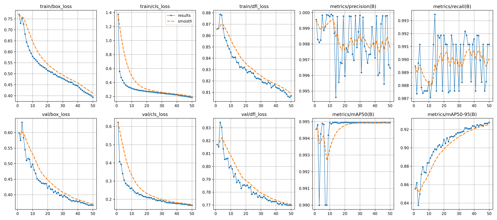

# 🚦 JetBot 기반 지능형 교통신호 시스템

> **YOLOv8 객체 탐지 + ROI 기반 혼잡도 분석 + 긴급차량 우선 신호 제어**

**2026.04 ~ 2026.08 · 4인 팀 캡스톤 프로젝트**

이 프로젝트는 카메라 영상에서 일반 JetBot과 긴급차량을 탐지하고, 트랙에 설정한 ROI 영역을 기준으로 교통 상황을 분석해 **혼잡도 기반 신호 제어와 긴급차량 우선 신호**로 연결하는 지능형 교통 시스템입니다.

> 이 저장소는 **팀 프로젝트 전체 코드와 산출물**을 포함하고 있습니다. 아래 `김강우 담당 역할`은 개인 포트폴리오 기준으로 실제 수행한 범위만 구분해 작성했습니다.

---

## 🎯 프로젝트 목표

단순히 객체를 탐지하는 데서 끝나지 않고, 탐지된 차량의 **종류와 위치를 실제 교통신호 판단에 활용**하는 것을 목표로 했습니다.

```text
Camera
  ↓
YOLOv8 객체 탐지
  ↓
JetBot / Ambulance 구분
  ↓
ROI 영역 기준 위치 판단
  ↓
혼잡 상황 / 긴급차량 접근 판단
  ↓
신호 제어 및 대시보드 연동
```

### 팀 시스템 주요 기능

- YOLOv8 기반 일반 JetBot / 긴급차량 탐지
- 트랙 ROI 영역을 활용한 차량 위치 구분
- 차량 수·정차시간 등의 요소를 활용한 혼잡 상황 분석
- 긴급차량 접근 시 해당 방향 우선 신호 처리
- ESP32 신호등 및 Flutter 대시보드와의 연동

---

## 🙋‍♂️ 김강우 담당 역할

### 1. 긴급차량 외형 제작

- 일반 JetBot과 시각적으로 구분할 수 있도록 **구급차 형태의 외형을 제작**했습니다.
- 실제 트랙 주행과 객체 탐지 데이터 수집에 활용할 수 있도록 구성했습니다.

### 2. 데이터 라벨링

- JetBot과 Ambulance 객체를 구분하기 위한 **학습 데이터 라벨링 및 라벨 상태 점검**을 진행했습니다.
- 최종 학습 데이터는 다음 규모로 구성했습니다.

| Class | Images |
|---|---:|
| JetBot | 6,801 |
| Ambulance | 8,021 |
| **Total** | **약 14,800** |

### 3. YOLOv8n 최종 모델 학습

최종 객체 탐지 모델 학습을 담당했습니다.

```text
Model   : YOLOv8n
Image   : 640
Epochs  : 50
Batch   : 8
Workers : 2
GPU     : Google Colab T4
```

학습 완료 후 팀 시스템에서 활용할 수 있도록 최종 모델 결과를 정리하고 검증 지표를 확인했습니다.

### 4. 혼잡도 분석 내용 정리·공유

- 차량 수와 정차시간 등 **혼잡도를 판단할 때 고려할 요소와 전체 처리 흐름**을 정리했습니다.
- 객체 탐지 이후 ROI 영역과 혼잡도 판단이 어떤 순서로 연결되는지 팀원들과 공유했습니다.

### 5. 트랙 ROI 구역 배치

- 트랙에서 차량의 위치를 구분하고 혼잡도 분석에 활용할 수 있도록 **ROI 분석 영역을 배치**했습니다.
- 객체가 어떤 영역에서 탐지되었는지를 기준으로 이후 교통 상황 판단에 연결할 수 있도록 구성했습니다.

---

## 📊 최종 모델 성능

최종 검증 결과는 다음과 같습니다.

| Metric | Result |
|---|---:|
| Validation Images | 1,482 |
| Instances | 1,500 |
| Precision | **0.996** |
| Recall | **0.991** |
| mAP@50 | **0.995** |
| mAP@50-95 | **0.928** |

### Training Results



높은 Precision과 Recall을 확인했지만, 단순 수치만 보는 것이 아니라 학습 과정에서 **Loss 변화와 mAP 추이**도 함께 확인하며 최종 모델 상태를 검토했습니다.

---

## 🧠 ROI와 교통 판단 연결

이 프로젝트에서 ROI는 객체 탐지 결과를 실제 시스템 판단으로 연결하기 위한 공간 기준으로 사용했습니다.

```text
차량 탐지
  ↓
탐지 위치 확인
  ↓
트랙 ROI 영역 구분
  ↓
영역별 차량 상황 확인
  ↓
혼잡도 및 긴급차량 우선 판단에 활용
```

객체가 **무엇인지** 탐지하는 것과 함께 **어디에서 탐지되었는지**를 구분해야 실제 교통신호 제어와 연결할 수 있다는 점을 프로젝트를 통해 경험했습니다.

---

## 🛠 기술 구성

### 직접 사용 / 수행

- Python
- YOLOv8n
- Google Colab
- 데이터 라벨링
- JetBot
- ROI 구역 구성

### 팀 시스템에서 활용

- Jetson Nano
- ESP32
- Flutter Dashboard
- ByteTrack
- Supabase
- 실시간 영상 스트리밍 / 신호 제어 모듈

> 팀 시스템 기술은 저장소 전체 구성 기준이며, 각 기능의 직접 구현 담당은 팀원별로 구분됩니다.

---

## 📁 주요 산출물

```text
model/
├── JetBot_Last.pt       # YOLOv8 PyTorch 모델
├── JetBot_Last.onnx     # ONNX 모델
└── results.png          # 최종 학습 결과 그래프

app/                     # Flutter Dashboard
esp32_signal_light_server/
ByteTrack-main/
hyojun_streamer/
supabase/
```

모델 폴더에는 팀 프로젝트에서 사용한 최종 모델과 학습 결과 파일이 포함되어 있습니다.

---

## 💡 프로젝트를 통해 배운 점

- 객체 탐지 모델의 성능은 학습 코드뿐 아니라 **데이터 라벨 상태와 클래스 기준**에 크게 영향을 받는다는 점을 경험했습니다.
- Precision, Recall, mAP 지표를 직접 확인하면서 객체 탐지 모델을 평가하는 기준을 이해했습니다.
- ROI를 이용해 객체 탐지 결과의 위치 정보를 구분하고, 이를 **혼잡도 판단 흐름에 연결하는 과정**을 이해했습니다.
- 팀 프로젝트에서는 자신의 기능만 구현하는 것이 아니라 **앞뒤 기능이 어떤 기준으로 연결되는지 공유하는 과정**도 중요하다는 점을 배웠습니다.

---

## 📌 Project Info

| Item | Description |
|---|---|
| Project Type | Computer Vision / Robot / Smart Traffic |
| Period | 2026.04 ~ 2026.08 |
| Team | 4인 팀 프로젝트 |
| Model | YOLOv8n |
| Dataset | JetBot 6,801 / Ambulance 8,021 |
| Repository | `KimKangwoo1/jetbot-yolov8-alignment` |
